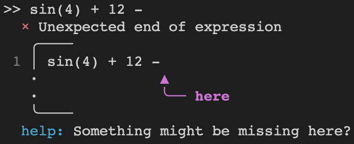

# Xprs

[](https://github.com/vic1707/xprs)
[](https://crates.io/crates/xprs)
[](https://github.com/vic1707/xprs/actions?query=branch%3Amain)
[](https://docs.rs/xprs)
[](https://crates.io/crates/xprs)

**Xprs** is a flexible and extensible mathematical expression parser and evaluator for Rust, designed for simplicity and ease of use (and ideally, speed).

## Installation

Add this to your `Cargo.toml`:

```toml
[dependencies]
xprs = "0.0.1-beta1"
```

or run this command in your terminal:

```bash
cargo add xprs
```

Make sure to check the [Crates.io](https://crates.io/crates/xprs) page for the latest version.

## MSRV (Minimum Supported Rust Version)

Currently, the minimum supported Rust version is `1.70.0`.

## Crate Features

- **`compile-time-optimizations`** _(enabled by default)_ :

  Enable optimization and evaluation during parsing.
  This feature will automagically transform expressions like `1 + 2 * 3` into `7` during parsing allowing for faster evaluation.
  It also works on functions (e.g. `sin(0)` will be transformed into `0`) and "logical" result like `(x - x) * (....)` will be transformed into `0` since `x - x` is `0` no matter what `x` is.

  Note: nightly channel enables even more optimizations thanks to `box_patterns` feature gate.

<br />

- **`pemdas`** _(enabled by default)_:

  Conflicts with the `pejmdas` feature.
  Uses the PEMDAS order of operations.
  This implies that implicit multiplication has the same precedence as explicit multiplication.
  For example:

  - `6/2(2+1)` gets interpreted as `6/2*(2+1)` which gives `9` as a result.
  - `1/2x` gets interpreted as `(1/2)*x` which, with `x` being `2`, gives `1` as a result.

  Note: `Display` and `Debug` shows additionnal parenthesis to make the order of operations more obvious.

<br />

- **`pejmdas`**:

  Conflicts with the `pemdas` feature.
  Uses the PEJMDAS order of operations.
  This implies that implicit multiplication has a higher precedence than explicit multiplication.
  For example:

  - `6/2(2+1)` gets interpreted as `6/(2*(2+1))` which gives `1` as a result.
  - `1/2x` gets interpreted as `1/(2*x)` which, with `x` being `2`, gives `0.25` as a result.

  Note: `Display` and `Debug` shows additionnal parenthesis to make the order of operations more obvious.

## Usage

### Simple examples

If you want to evaluate a simple calculus that doesn't contains any variables, you can use the `eval_no_vars` method (or `eval_no_vars_unchecked` if you know for sure that no variables are present):

```rust
use xprs::Xprs;

fn main() {
    let xprs = Xprs::try_from("1 + sin(2) * 3").unwrap();
    println!("1 + sin(2) * 3 = {}", xprs.eval_no_vars().unwrap());
}
```

Note: Numbers are parsed as `f64` so you can use scientific notation (e.g. `1e-3`) with underscores (e.g. `1_000_000e2`).

If you want to evaluate a calculus that contains variables, you can use the `eval` method (or `eval_unchecked` if you know for sure you're not missing any variables):

```rust
use xprs::Xprs;

fn main() {
    let xprs = Xprs::try_from("1 + sin(2) * x").unwrap();
    println!(
        "1 + sin(2) * x = {}",
        xprs.eval(&[("x", 3.0)].into()).unwrap()
    );
}
```

You can also turn the calculus into a function and use it later:

```rust
use xprs::Xprs;

fn main() {
    let xprs = Xprs::try_from("1 + sin(2) * x").unwrap();
    let fn_xprs = xprs.bind("x").unwrap();
    println!("1 + sin(2) * 3 = {}", fn_xprs(3.0));
}
```

You can use functions `bind`, `bind2` etc up to `bind9` to bind variables to the calculus.
If you ever need more, you can use the `bind_n` and `bind_n_runtime` methods which takes an array of size N or a slice respectively.

Notes:
All `bind` function (except `bind_n_runtime`) returns a `Result` of a function which is guarenteed to return a `f64`.
`bind_n_runtime` returns a `Result` of a function which also returns a `Result` of a `f64` since there are no guarentees that the array/slice will be of the correct size.

### Context and Parser

You can also create a `Context` and a `Parser` instance if you want to define your own functions and/or constants and use them repeatedly.

Constants and Functions can have any name that starts with a letter (uppercase of not) and contains only `[A-Za-z0-9_']`.

Functions need to have a signature of `fn(&[f64]) -> f64` so they all have the same signature and can be called the same way.
We also need a name and the number of arguments the function takes, which is an `Option<usize`, if `None` then the function can take any number of arguments.
You can define functions like so:

```rust
use xprs::{Function, xprs_fn};

fn double(x: f64) -> f64 {
    x * 2.0
}

const DOUBLE: Function = Function::new("double", move |args| double(args[0]), Some(1));
// or with the macro (will do an automatic wrapping)
const DOUBLE: Function = xprs_fn!("double", double, 1);

fn variadic_sum(args: &[f64]) -> f64 {
    args.iter().sum()
}

const SUM: Function = Function::new("sum", variadic_sum, None);
// or with the macro (no wrapping is done for variadic functions)
const SUM: Function = xprs_fn!("sum", variadic_sum);
```

To use a `Context` and a `Parser` you can do the following:

```rust
use xprs::{xprs_fn, Context, Parser};

fn main() {
    let mut context = Context::default()
        .with_fn(xprs_fn!("double", |x| 2. * x, 1))
        .with_var("foo", 1.0);
    context.set_var("bar", 2.0);

    let xprs = Parser::new_with_ctx(context)
        .parse("double(foo) + bar")
        .unwrap();
    println!("double(foo) + bar = {}", xprs.eval_no_vars().unwrap());
}
```

Note: `Context` is just a wrapper around a `Hashmap` so you cannot have a function and a constant with the same name (the last one will override the first one).

You can also use the `Context` to restrict the allowed variables in the calculus:

```rust
use xprs::{Context, Parser};

fn main() {
    let context = Context::default()
        .with_expected_vars(["x", "y"].into());

    let parser = Parser::new_with_ctx(context);

    let result = parser.parse("x + y"); // OK
    let fail = parser.parse("x + z"); // Error

    println!("{result:#?} {fail:#?}");
}
```

### Error handling

All errors are implemented using the [`thiserror`](https://crates.io/crates/thiserror).
And parsing errors are implemented using the [`miette`](https://crates.io/crates/miette) crate.


### Supported operations, built-in constants & functions

#### Operations

Xprs supports the following operations: - Binary operations: `+`, `-`, `*`, `/`, `^`, `%`. - Unary operations: `+`, `-`. <!--, `!` -->

#### Built-in constants

| Constant | Value | Approximation       |
| -------- | ----- | ------------------- |
| `PI`     | `π`   | `3.141592653589793` |
| `E`      | `e`   | `2.718281828459045` |

#### Built-in functions

Xprs supports a variety of functions:

- trigonometric functions: `sin`, `cos`, `tan`, `asin`, `acos`, `atan`, `atan2`, `sinh`, `cosh`, `tanh`, `asinh`, `acosh`, `atanh`.
- logarithmic functions: `ln` (base 2), `log` (base 10), `logn` (base n, used as `logn(num, base)`).
- power functions: `sqrt`, `cbrt`, `exp`.
- rounding functions: `floor`, `ceil`, `round`, `trunc`.
- other functions: `abs`, `min`, `max`, `hypot`, `fract`, `recip` (`invert` alias), `sum`, `mean`.

Note: `min` and `max` can take any number of arguments (if none, returns `f64::INFINITY` and `-f64::INFINITY` respectively).
Note2: `sum` and `mean` can take any number of arguments (if none, returns `0` and `f64::NAN` respectively).

### Advanced examples

## Higher order functions

TODO: Coming soon

These examples and others can be found in the [examples](./examples) directory.

## Documentation

Complete documentation can be found on [docs.rs](https://docs.rs/xprs).

## Licence

Copyright © 2023 [Victor LEFEBVRE](contact@vic1707.xyz)
This work is free. You can redistribute it and/or modify it under the
terms of the Do What The Fuck You Want To Public License, Version 2,
as published by Sam Hocevar. See the [LICENCE](./LICENCE). file for more details.
